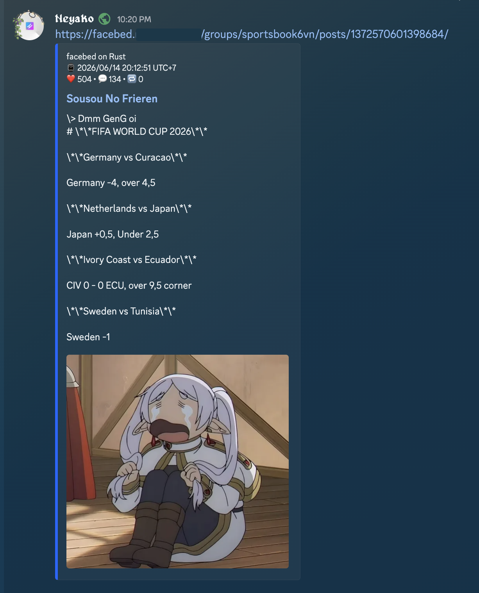

# facebed

Facebook URL -> OpenGraph embed proxy for Discord and other messaging apps.



Replace `www.facebook.com` with `facebed.com`. Crawlers get a small HTML page with OpenGraph
metadata; people using a normal browser get redirected back to Facebook.

facebed is not affiliated with Meta or Facebook.

## For users

Change this:

```text
https://www.facebook.com/example/posts/123
```

to this:

```text
https://facebed.com/example/posts/123
```

Supported link shapes:

- Public and cookie-viewable posts, group posts, `story.php`, and `permalink.php`.
- Single photos: `/photo` and `/photo.php`.
- Image-in-comment links with `?type=3`.
- Reels: `/reel/<id>`.
- Watch and Page video posts: `/watch?v=<id>` and `<page>/videos/.../<id>`.
- 24-hour stories: `/stories/<author_id>/<media_id>`.
- Mobile share links: `/share/r/...`, `/share/p/...`, and `/share/v/...`.

The public `facebed.com` instance can only resolve links that Facebook exposes to an
incognito/no-login browser. For friends-only posts, private groups, restricted stories, and other
cookie-only content, self-host facebed and bring your own Facebook cookies.

<details>
<summary>Vencord settings</summary>

Using regex:

- Find: `https://(www.)?facebook.com/(.*)`
- Replace: `https://facebed.com/$2`

</details>

## What changed from the old Python script

The original public project was a Python/Bottle app. This branch is a Rust port built with
axum, reqwest, scraper, tokio, and serde. The Python implementation has been removed from the
tree; use `git log` if you need to inspect it.

| Area | Python script | Rust port |
| --- | --- | --- |
| Runtime | Python 3.12+ plus Bottle, BeautifulSoup, requests, yattag, crawler UA packages, and helper start scripts. | Single Rust binary with async axum server and reqwest client. |
| Deploy artifact | Python files, virtualenv, and runtime dependencies. | Multi-stage musl build into a `scratch` image, non-root uid/gid 65532. |
| Update model | Included a remote `/update` hook protected by config credentials. | No remote self-update endpoint; deploy through normal image or process replacement. |
| Parser layout | One large `facebed.py` file. | Small parser modules for posts, photos, photo comments, reels, watch videos, and stories. |
| URL coverage | Posts, photos, reels, watch, share links, and photo comments. | Keeps those and adds story support, Page-video routing, group multi-permalink cleanup, and more mobile-share handling. |
| Cookie support | One `cookies.json`; expired timestamps disabled cookies and warned. | Priority account pool from `cookies*.json`, optional multi-account JSON, live startup checks, per-account user agents, cooldown, retries, and group/profile affinity. |
| Share links | Public HEAD redirect resolution. | Cookie-aware HEAD/body resolution, group-landing rejection, and Discord-budget timeout handling. |
| Facebook JSON extraction | Recursive helpers inside the single script. | Shared `jq` helpers plus parser-local matching, with tests around recent schema/routing failures. |
| Discord behavior | Basic OG image/video embeds and error embeds. | Markdown-safe descriptions, link-card text fallback, mixed-media handling, oversized-video thumbnail fallback, timeout embeds, and stable error codes. |
| Failure triage | Parser errors could post HTML to Discord. | Preserves parser HTML attachments, adds account-health alerts, status/final-url/body-size logs, and explicit `C/P/U/X/T` embed states. |

## How it works

1. `routes.rs` receives every request through axum.
2. Human user agents get a `301` and a tiny redirect page.
3. Bot/crawler user agents continue to embed generation.
4. Mobile share links are resolved to the real Facebook target.
5. Tracking parameters are stripped.
6. The cleaned path is dispatched to a parser.
7. The parser fetches Facebook HTML, extracts JSON blocks, and returns a `ParsedPost`.
8. `embed.rs` renders minimal OG/Twitter meta tags for Discord and other preview crawlers.

Parser dispatch:

- `?type=3` -> photo comment parser.
- `/stories/<author>/<media>` -> stories parser.
- `/reel/<id>` -> reels parser.
- `/photo` and `/photo.php` -> single-photo parser.
- `/watch` and Page video URLs -> watch-video parser.
- Supported post/group/permalink/story paths -> JSON post parser.

## Error embeds

The suffix in an error embed is intentional and user-visible:

- `C` - no data: login wall, restricted content, expired story, or unsupported URL.
- `P` - parser failure: likely Facebook changed JSON shape; HTML is sent to the webhook when enabled.
- `U` - HTTP, IO, JSON, or YAML failure.
- `X` - unexpected error.
- `T` - Facebook did not finish within the Discord crawler budget.

Do not rename these codes without coordinating with maintainers; they are useful in screenshots
and production triage.

Discord note: embeds have been reliable in servers during production use. Some DMs may still fail
to show a preview even when the same link embeds elsewhere; this appears to be Discord-side preview
behavior rather than a facebed parser failure.

## Deploy with Docker

```bash
cp config.example.yaml config.yaml
cp cookies.example.json cookies.json
$EDITOR config.yaml
$EDITOR cookies.json
docker compose up -d --build
```

The container serves plain HTTP on port `9812`. Put nginx, Caddy, Traefik, or another reverse
proxy in front of it for TLS.

Common commands:

```bash
docker compose up -d --build
docker compose logs -f
docker compose down
```

## Local development

Requires Rust 1.75 or newer.

```bash
cargo run -- -c config.yaml
```

With defaults only:

```bash
cargo run
```

Release build:

```bash
cargo build --release
./target/release/facebed -c config.yaml --cookies cookies.json
```

Verbose logs:

```bash
RUST_LOG=debug cargo run -- -c config.yaml
```

## Config

Config is YAML. Pass it with `-c <path>`. Missing keys use defaults.

| Key | Default | Notes |
| --- | --- | --- |
| `host` | `0.0.0.0` | Bind address. |
| `port` | `9812` | HTTP port. |
| `timezone` | `7` | UTC offset for embed timestamps. Valid range: `-12` to `14`. |
| `banned_users` | `[]` | Facebook author IDs that return a placeholder embed. |
| `notifier_webhook` | `""` | Discord webhook for parser failures and cookie-account health alerts. |

## Cookies and account pool

Cookies are optional, but private groups, friends-only posts, and some stories need them.

The server loads the requested cookie path, defaulting to `./cookies.json`, and also scans the
same directory for sibling `cookies*.json` files. `cookies.example.json` is ignored.

Accepted cookie shapes:

```json
[
  {"name": "c_user", "value": "100000000000001", "domain": ".facebook.com", "expirationDate": 4070908800},
  {"name": "xs", "value": "REPLACE_ME", "domain": ".facebook.com", "expirationDate": 4070908800}
]
```

or:

```json
{
  "accounts": [
    {
      "label": "alice",
      "entries": [
        {"name": "c_user", "value": "100000000000001"},
        {"name": "xs", "value": "REPLACE_ME"}
      ]
    }
  ]
}
```

For flat Cookie-Editor exports, the account label comes from the filename:

- `cookies.json` -> `default`
- `cookies-alice.json` -> `alice`
- `cookies2.json` -> `2`

At runtime, accounts are tried in priority order. Accounts that fail are cooled down for a short
period, and a group/profile affinity map remembers which account worked last time. This keeps
repeat embeds fast without making every request rotate blindly.

On startup, facebed probes each cookie account with `facebook.com/me`. It logs the visible account
name when the account is healthy, and posts to the webhook when one or more accounts look blocked,
checkpointed, logged out, or unreadable.

After three consecutive fetch failures for the same account, facebed sends another webhook alert
with the account label so the operator knows which cookie file needs attention.

### Per-account user agents

Create `useragents.json` next to the cookie files:

```json
{
  "default": "Mozilla/5.0 (Windows NT 10.0; Win64; x64) AppleWebKit/537.36 (KHTML, like Gecko) Chrome/132.0.0.0 Safari/537.36",
  "alice": "Mozilla/5.0 (Macintosh; Intel Mac OS X 10_15_7) AppleWebKit/605.1.15 (KHTML, like Gecko) Version/17.2 Safari/605.1.15"
}
```

Missing labels use the default Chrome-like user agent. A `user_agent` field inside a multi-account
cookie object takes precedence over the sidecar file.

Warning: cookie-backed scraping can hit rate limits or trigger Facebook checkpoints. Use dedicated
accounts, not a primary personal account.

## Verification

Run the unit tests:

```bash
cargo test
```

Check formatting:

```bash
cargo fmt -- --check
```

Run locally and request an embed as Discord:

```bash
cargo run -- -c config.yaml
curl -A 'Discordbot/2.0' 'http://localhost:9812/<facebook-path>'
```

Inspect the returned HTML for `og:title`, `og:description`, `og:image`, `og:video`, and
`og:site_name` tags.

## Production notes

- Keep the crawler-user-agent gate. Humans should redirect to Facebook instead of seeing the embed page.
- Keep parser failures noisy. `P` errors with raw HTML attachments are how Facebook schema changes get fixed.
- Keep the Rust image small and boring. The current Dockerfile builds a static release binary and copies only the binary plus assets into `scratch`.
- Prefer targeted parser changes over large rewrites; Facebook URL families use different JSON shapes.
- If a video is larger than Discord's media proxy limit, facebed serves the thumbnail and a click-through hint instead of an empty video card.

## License

MIT
