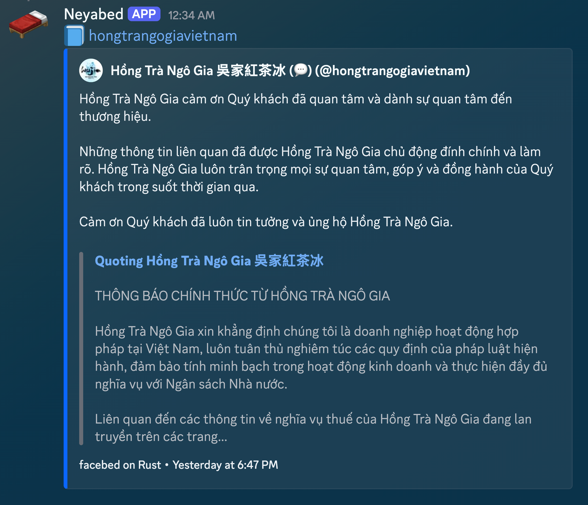
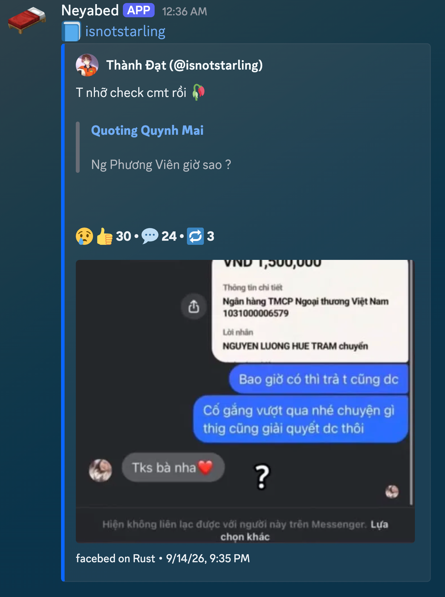

# facebed-rusty

Self-hosted Facebook embeds for Discord, written in Rust.
Run this fork on your own server and domain.

This fork adds full Markdown support, comment embeds, and quotes from shared
posts.

Replace `facebook.com` with your own domain:

```text
https://www.facebook.com/example/posts/123
https://facebed-rusty.example.com/example/posts/123
```

Discord shows the post's text and media. People who open the link go to Facebook.
Supports posts, photos, reels, videos, stories, comments, and share links.

## Examples

### Full Markdown


### Comments



### Shared-post quotes



## Run it

You need Git, Docker Compose, and a public domain.

```bash
git clone https://github.com/neyako/facebed-rusty.git
cd facebed-rusty
cp config.example.yaml config.yaml
printf '[]\n' > cookies.json
docker compose up -d --build
```

The server listens on `0.0.0.0:9812`. Point your domain at it through an HTTPS
proxy or tunnel so chat apps can reach it.

See [config.example.yaml](config.example.yaml) for the port, timezone, blocked
authors, and Discord alert settings. Restart the service after changes.

## Cookies

Leave `cookies.json` empty (`[]`) to try public posts. If Facebook asks you to log
in, save a Cookie-Editor export there. The account must have access to the post.
See [cookies.example.json](cookies.example.json) for the format.

For more accounts, add files such as `cookies-alice.json` and enable their mounts
in [docker-compose.yml](docker-compose.yml). Recreate the container after changes:

```bash
docker compose up -d --force-recreate
```

## Develop

Requires Rust 1.75 or newer.

```bash
cargo run -- -c config.yaml
cargo test --locked
cargo fmt --check
```

## Contribute

Contributions are welcome. Open an issue or send a pull request.

Rust port of [facebed/facebed](https://github.com/facebed/facebed). MIT license.
Not affiliated with Meta or Facebook.
